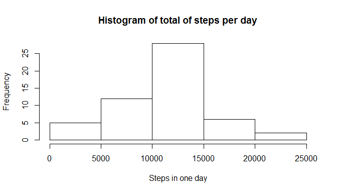
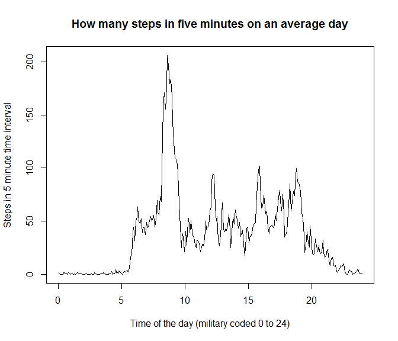

# Reproducible Research: Peer Assessment 1


## Loading and preprocessing the data

### Unzipping and reading in data


```r
# path to directory where zipfile  activity.zip  is
# needs to be changed to your local situation.
setwd("~/05_Reproducible_Research/RepData_PeerAssessment1")

# unzipping and putting the data into a data.frame
unzip("activity.zip")
read.csv("activity.csv") -> data
```
If the unzip instruction causes problems on your machine (it is operating system dependent). Unzip by hand and skip the unzip instruction in the code.

### What is the data about?

This assignment makes use of data from a personal activity monitoring device. This device collects data at 5 minute intervals through out the day. The data consists of two months of data from an anonymous individual collected during the months of October and November, 2012 and include the number of steps taken in 5 minute intervals each day.  
Looking into the data.frame first 3 and last 3 rows:


```r
head(data,3)
```

```
##   steps       date interval
## 1    NA 2012-10-01        0
## 2    NA 2012-10-01        5
## 3    NA 2012-10-01       10
```

```r
tail(data,3)
```

```
##       steps       date interval
## 17566    NA 2012-11-30     2345
## 17567    NA 2012-11-30     2350
## 17568    NA 2012-11-30     2355
```
From the rownumbers shown in the output we see there are 17568 rows.  
We expect, with one measurement every 5 minutes:  ((31 +30) * 24 * 60 ) / 5 = 17568

We will deal later with the NA (not available) values in the steps column.

### Adding some columns to the data.frame

For making plots the interval column is not nice, the points are not equidistant. From 535 to the next point 540 is 5 units, from 555 to the next point 600 is 45 units. It is composed off the 
hour * 100 + minutes counted from the whole hour.

We decompose it to added columns "hour" an "minute". These two are combined to get a nice equidistant scale "time". The + 2.5 in the expression is because the middle of the interval is a more precise representation as the beginning.


```r
data.frame(data, hour = as.integer(floor(data$interval/100))) -> data
data.frame(data, minute = as.integer(data$interval - data$hour * 100)) -> data
data.frame(data, time = data$hour + (data$minute + 2.5)/60) -> data
```
See the result

```r
head(data,3)
```

```
##   steps       date interval hour minute       time
## 1    NA 2012-10-01        0    0      0 0.04166667
## 2    NA 2012-10-01        5    0      5 0.12500000
## 3    NA 2012-10-01       10    0     10 0.20833333
```

```r
tail(data,3)
```

```
##       steps       date interval hour minute     time
## 17566    NA 2012-11-30     2345   23     45 23.79167
## 17567    NA 2012-11-30     2350   23     50 23.87500
## 17568    NA 2012-11-30     2355   23     55 23.95833
```

## What is mean total number of steps taken per day?

First the sum of all intervals and the count of intervals with without NA's is calculated. See code below.

```r
na.omit(data) -> data2
unique(data2$date) -> dates
data.frame(date = dates , stepstotal = numeric(length(dates)),
            intervals = numeric(length(dates))) -> datapd
for( d in dates)  {
   sum(data2$steps[data2$date == d]) ->  datapd$stepstotal[datapd$date == d]
   length(data2$steps[data2$date == d]) ->  datapd$intervals[datapd$date == d]
}
datapd
```

```
##          date stepstotal intervals
## 1  2012-10-02        126       288
## 2  2012-10-03      11352       288
## 3  2012-10-04      12116       288
## 4  2012-10-05      13294       288
## 5  2012-10-06      15420       288
## 6  2012-10-07      11015       288
## 7  2012-10-09      12811       288
## 8  2012-10-10       9900       288
## 9  2012-10-11      10304       288
## 10 2012-10-12      17382       288
## 11 2012-10-13      12426       288
## 12 2012-10-14      15098       288
## 13 2012-10-15      10139       288
## 14 2012-10-16      15084       288
## 15 2012-10-17      13452       288
## 16 2012-10-18      10056       288
## 17 2012-10-19      11829       288
## 18 2012-10-20      10395       288
## 19 2012-10-21       8821       288
## 20 2012-10-22      13460       288
## 21 2012-10-23       8918       288
## 22 2012-10-24       8355       288
## 23 2012-10-25       2492       288
## 24 2012-10-26       6778       288
## 25 2012-10-27      10119       288
## 26 2012-10-28      11458       288
## 27 2012-10-29       5018       288
## 28 2012-10-30       9819       288
## 29 2012-10-31      15414       288
## 30 2012-11-02      10600       288
## 31 2012-11-03      10571       288
## 32 2012-11-05      10439       288
## 33 2012-11-06       8334       288
## 34 2012-11-07      12883       288
## 35 2012-11-08       3219       288
## 36 2012-11-11      12608       288
## 37 2012-11-12      10765       288
## 38 2012-11-13       7336       288
## 39 2012-11-15         41       288
## 40 2012-11-16       5441       288
## 41 2012-11-17      14339       288
## 42 2012-11-18      15110       288
## 43 2012-11-19       8841       288
## 44 2012-11-20       4472       288
## 45 2012-11-21      12787       288
## 46 2012-11-22      20427       288
## 47 2012-11-23      21194       288
## 48 2012-11-24      14478       288
## 49 2012-11-25      11834       288
## 50 2012-11-26      11162       288
## 51 2012-11-27      13646       288
## 52 2012-11-28      10183       288
## 53 2012-11-29       7047       288
```

There are 8 days with only NA values for all intervals.

There are 0 days with NA values in some of the intervals.


```r
hist(datapd$stepstotal, main="Histogram of total of steps per day", xlab="Steps in one day")
```

 

The mean steps per day in this period was:


```r
mean(datapd$stepstotal)
```

```
## [1] 10766.19
```

The median steps per day in this period was:


```r
median(datapd$stepstotal)
```

```
## [1] 10765
```


## What is the average daily activity pattern?


```r
na.omit(data) -> data2
unique(data2$time) -> times
data.frame(time = times , stepstotal = numeric(length(times)),
            intervals = numeric(length(times))) -> datapt
for( t in times)  {
   sum(data2$steps[data2$time == t]) ->  datapt$stepstotal[datapt$time == t]
   length(data2$steps[data2$time == t]) ->  datapt$intervals[datapt$time == t]
}
data.frame(datapt, stepsmeaninterval = datapt$stepstotal/datapt$intervals) -> datapt
```


```r
plot(datapt$time, datapt$stepsmeaninterval, type="l",
     main="How many steps in five minutes on an average day",
     xlab="Time of the day (military coded 0 to 24)",
     ylab="Steps in 5 minute time interval")
```

 

## Imputing missing values

We add a column to the dataframe data with the name "steps2"
If column steps has a NA we take the dayly averaged value for that interval in steps2.


```r
data.frame(data, steps2=data$steps) -> data
ifelse(is.na(data$steps), 
       round(datapt$stepsmeaninterval[datapt$time==data$time],0) , 
       data$steps) -> data$steps2
```


## Are there differences in activity patterns between weekdays and weekends?

We add a factor column "typeday" with values weekday or weekend.
See code below:

```r
as.POSIXlt(data$date)$wday -> temp
ifelse(temp ==0 | temp == 6, "weekend", "weekday") -> temp
as.factor(temp) -> temp
data.frame(data, typeday=temp) -> data
```

Look if it worked:


```r
head(data)
```

```
##   steps       date interval hour minute       time steps2 typeday
## 1    NA 2012-10-01        0    0      0 0.04166667      2 weekday
## 2    NA 2012-10-01        5    0      5 0.12500000      0 weekday
## 3    NA 2012-10-01       10    0     10 0.20833333      0 weekday
## 4    NA 2012-10-01       15    0     15 0.29166667      0 weekday
## 5    NA 2012-10-01       20    0     20 0.37500000      0 weekday
## 6    NA 2012-10-01       25    0     25 0.45833333      2 weekday
```

```r
tail(data)
```

```
##       steps       date interval hour minute     time steps2 typeday
## 17563    NA 2012-11-30     2330   23     30 23.54167     NA weekday
## 17564    NA 2012-11-30     2335   23     35 23.62500     NA weekday
## 17565    NA 2012-11-30     2340   23     40 23.70833     NA weekday
## 17566    NA 2012-11-30     2345   23     45 23.79167     NA weekday
## 17567    NA 2012-11-30     2350   23     50 23.87500     NA weekday
## 17568    NA 2012-11-30     2355   23     55 23.95833     NA weekday
```

RUN OUT OF TIME
